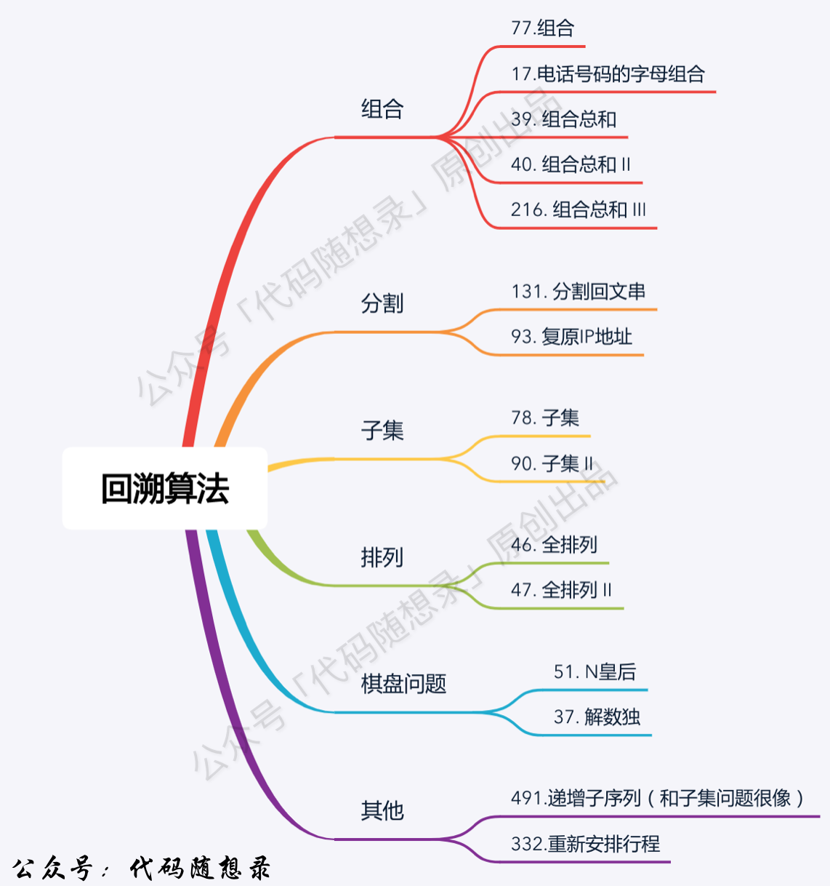

# 0 前言

> 该文档于2023/11/6日建立，用于记录学习中常用的算法，便于日后复习，
> 资料收集大部分来自网络及书本

# 0.1程序速率优化

见文章，[卡常技巧,速率优化](https://zhuanlan.zhihu.com/p/608989466#:~:text=)

#  1基础知识


## 0.1 小tips

> 1.使用遍历去重时，`nums[i] == nums[i+1]`是将下标移动到同一块相同区间的最有边，`nums[i] == nums[i - 1]`是将下标移动到每个不同重复数区间的开头，若可能需要用到重复数时，让其停留在左边
>
> 2.如果使用for循环遍历，需要对循环数进行操作，如果只++，则continue，不要++操作，否则会加两次，，如果进行其他复杂操作，可以使用while来循环。
>
> 3.使用string s；容器时，不要使用`s = (char)a + s;`这种操作，使用`s += (char)a;`


## 1 快速排序

> 快速排序用于对一段区间的数按某个指标大小进行排序，不稳定排序
> 在遇到需要排序的题目时，一般排序作为一个中间步骤，快速排序是使用较为广泛的一种排序
>
> 时：均值$O(nlogn)$   空：$O(logn)$
>
> 在算法题中常用标准库中函数来进行排序 [std::sort ](https://www.apiref.com/cpp-zh/cpp/algorithm/sort.html)

> 原理：
>
> 使用了分治的思想，取一个值，将区间按该值分为两段小区间，在两段小区间中重复该步骤，区间长度为1时停止
>
> 1. 确定分界点
> 2. 调整区间
> 3. 递归处理左右区间
>
> ```c++
> void quick_sort(int q[], int l, int r){
>     if(l>=r) return;
>     
>     int x=q[l], i=l-1, j=r+1;  //取分界值,注意分界值不能取r，i,j有偏移量
>     while(i < j){
>         do i++ ; while (q[i] < x);   //偏移量作用，同时找到i，j该交换的位置
>         do j-- ; while (q[j] > x);
>         
>         if(i < j) swap(q[i],q[j]);  //由于do~while，会先执行一步加减，需要判断
>     }
>     
>     quick_sort(q,l,j);    //递归左右区间
>     quick_sort(q,j+1,r);
> }
> ```
>
> 快速排序中边界问题较为繁琐，可以参考[快速排序中的边界问题](https://blog.csdn.net/SHU15121856/article/details/109839618)

## 2 归并排序

> 与快速排序不同的是，归并排序是先排序，后合并，属于稳定排序。适用于将两个排好序的区间合并的题，
> 参考标准库使用方法  [std::merge](https://zh.cppreference.com/w/cpp/algorithm/merge)
>
> 1. 确定分界点
> 2. 递归排序
> 3. 合二为一
>
> 时：$O(nlogn)$  空：$O(n+logn)$额外数组+压入栈所需空间
>
> ```C++
> void merge_sort(int q[], int l, int r)
> {
>     if (l >= r) return;
> 
>     int mid = l + r >> 1;
>     merge_sort(q, l, mid);
>     merge_sort(q, mid + 1, r);
> 
>     int k = 0, i = l, j = mid + 1;
>     while (i <= mid && j <= r)
>         if (q[i] <= q[j]) tmp[k ++ ] = q[i ++ ];
>         else tmp[k ++ ] = q[j ++ ];
> 
>     while (i <= mid) tmp[k ++ ] = q[i ++ ];
>     while (j <= r) tmp[k ++ ] = q[j ++ ];
> 
>     for (i = l, j = 0; i <= r; i ++, j ++ ) q[i] = tmp[j];
> }
> 
> ```
>
> 

## 3 二分

> 根据某种性质，可以将某个区间一分为二，二分可以用于寻找该性质的边界点
>
> 注意：单调，二分不仅仅用于找某个值，还可以用于寻找性质边界


### 01 整数二分

> ```C++
> //在全局中有一个数组，传入的是下标
> 
> bool check(int x) {/* ... */} // 检查x是否满足某种性质
> 
> //*****************************************************************************
> //此版本[)，寻找的是左边界
> int bsearch_1(int l, int r)
> {
> while (l < r)
> {
> int mid = l + r >> 1;
> if (check(mid)) r = mid;    // check()判断mid是否满足性质
> else l = mid + 1;
> }
> return l;
> }
> 
> 
> 
> int bsearch_2(int l, int r)
> {
> while (l < r)
> {
> int mid = l + r + 1 >> 1;
> if (check(mid)) l = mid;
> else r = mid - 1;
> }
> return l;
> }
> 
> 
> //容易理解版本
> int binary_search3(vector<int>& nums, int target) {
> //定义区间为左闭右闭
> int left = 0, right = nums.size() - 1;
> 
> while (left <= right) {   //等于有意义
>   int middle = left + ((right - left) >> 1);  //防止变量内存溢出
>   if (nums[middle] > target)              //移动右边界
>       right = middle - 1;
>   else if (nums[middle] < target)          //移动左边界
>       left = middle + 1;
>   else if(nums[middle] == target)   
>       return middle;			//找到目标返回
> }
> 
> return -1; //找不到则返回-1；
> }
> 
> ```

#### 二分边界

> 二分法在存在重复元素时，可以用于寻找元素边界
>
> + 某段的边界，如最小符合，最大符合等
>
> ​			若发现目标时不立即退出，最后都会出现 `left = right + 1` 的情况，即right在left左边一单位
> ​	同时，在寻找左边界时，相同移动right，结束时，若目标存在，则left指向第一个元素，若目标不存在则left指向待插入位置。
> ​		在寻找右边界时，相同移动left，结束时，若目标存在，则right = left -1 指向未元素。若目标不存在，则不论移动左右，left最后均处于待插入的地方。
> ​			注意，左右边界的移动，可能使得下标越界，在访问之前进行处理。比如首尾元素需要插入，用二分法确定插入位置时，right为-1 / left下标为size（） 		
>
> ```c++
> //单独寻找左右边界
> int binary_searchL(vector<int>& nums, int target){
>     int left = 0, right = nums.size() - 1;
> 
>     while(left <= right){
>         int middle = left + ((right - left) >> 1);
>         if(nums[middle] >= target) right = middle -1; //右边界将=号删除，最后返回right
>         else left = middle + 1;
>     }
>     return left;    //left可能是首元素，可能是插入位置，根据需要进行更改
> }
> 
> 
> ```
>
> 

### 02 浮点数二分

> ```C++
> bool check(double x) {/* ... */} // 检查x是否满足某种性质
> 
> double bsearch_3(double l, double r)
> {
>     const double eps = 1e-6;   // eps 表示精度，取决于题目对精度的要求
>     while (r - l > eps)
>     {
>         double mid = (l + r) / 2;
>         if (check(mid)) r = mid;
>         else l = mid;
>     }
>     return l;
> }
> ```
>
> 

## 4 递推与递归

> 相关参考资料
>
> + [递推与递归的关系](https://www.zhoulujun.cn/html/theory/engineering/model/7307.html)

### 01递推

> 从已知到未知
>
> ```c++
> int main(void){
>     vector<int>a(100);
>     a[1] = 1;
>     a[2] = 1;
>     for(int i = 3;i<=99;i++){
> 		a[i] = a[i-1] + a[i-2];  //通过过去已知的状态推导未来未知的状态，已知到未知
>     }
>     return 0;
> }
> 
> ```

### 02递归

> 从未知到已知
>
> ```c++
> int fei(int n){
>     if(n == 1 || n == 2){
>         return n;
>     }
>     //n未知，但是n为1和2时已知，将n向下递归，得到结果后一步步返回为回溯
>     return fei(n-1) + fei(n-2);
> }
> ```

### 03回溯

> 回溯是一种思想，为程序结束后的返回，为一条注定要返回的小路，你和同伴走入森林，他进入了一条小路，你知道他一定会回来，你在此等待。

## 5 高精度

## 6 前缀和与差分

> 滑动窗口

```c++
int minLen(array v,int target){
int l=0,r=0;
int n =v.size();

int len=999999;
int sum = 0;
while(r<v){
    sum+=v[r];
    while(sum >= target){
        len=r-l+1<target?r-l+1:target;
        sum-=v[l];
	   l++;
    }
    r++;
}

return len==99999?0:len;
```
}

## 7 双指针算法

> 双指针算法，快慢指针算法，通过同时维护两个指向数据的变量，来进行一些操作
>
> + 在遍历的时候对自身进行一些操作

### 常见问题

> 代码方式带来的问题，使用while循环去寻找目标元素，可能会出现：在正常结束前，因为慢指针快于快指针而导致结束
>
> ```c++
> int minLen(array v,int target){
>     int l=0,r=0;
>     int n =v.size();
>     
>     int len=999999;
>     int sum = 0;
>     while(r<v){
>         sum+=v[r];
>         while(sum >= target){
>             len=r-l+1<target?r-l+1:target;
> 		   l++;
>         }
>         r++;
>     }
>     
>     return len==99999?0:len;
> }
> ```
>
> 

## 8 位运算

## 9 离散化

## 10 RMQ


# 2 搜索

> 搜索是一种穷举的思想，搜索每一种可能性，以寻找所需

## 0概述

搜索应用常见有五类：组合，分割，子集，排列，棋盘

> 组合：N个数里按一定规则找出k个数的集合。**正常搜索取数，根据条件停止。**
>
> 排列：N个数里按一定规则找出k个数的排列，与集合不同，排列强调元素顺序
>
> 切割：一个字符串按一定规则有怎样的切割方式？有几种切割方式？**取下标(类比取数)，表示从该下标后添加分割线，将符合条件的记录，一般穷举完后结束**
>
> 子集：一个N个数的集合里有多少种符合条件的子集？分别是什么？  **正常取数，将符合条件的节点都记录下来，一般穷举完成后结束**
>
> 

> 


## 1模板

> 回溯代码模板:注意，这是基础模板，运用时需要根据实际情况进行调整
>
> ```c++
> void checkback(参数){
>     if(终止条件){
>         存放结果;
>         return;
>     }
>     
>     for(选择：本层集合中元素(本次搜索范围){
>         处理节点;
>         checkback(参数);
>         回溯，撤销处理结果;
>     }
> }
> ```
>
> 剪枝优化：
>
> 由于暴力求解是穷举所有情况，但有些情况可以确定是非目标解，可以跳过不进行搜索，以此减少搜索范围

## 2去重

### 01树枝去重

> 需排序，大意是，同一个组合中，不能选相同的数
>
> ```c++
> v[i] == v[i-1] && used[i-1] == true   //此时表示相同的数已经被选择
> ```
>
> 

### 02数层去重

> 需排序，大意是，选择一个数，前一个选了，并且回溯回来，下一个数不选择与它相同的数，有两种方法
>
> ```c++
> //设立used[]数组  false表示当前没有被选择
> v[i] == v[i-1] && used[i-1] == false   //表示已经取过了
>     
> //使用开始下标判断   因为每层选择一个且是从左往右选择，故相同前一个一定被访问过
> v[i] == v[i-1] && i > startindex     //相等时表示这一层刚开始选，是第一个故不可能重复
> ```
>
> 若无法排序，可以在本层使用一个unordered_set去重,由于是在函数内定义，所以不会影响到其他层，


# 3动态规划


## 3.1理论基础

> 动态规划，现在的状态是由之前的状态推导而来，而现在的状态可以影响未来的状态。
>
> 所以如果求某个点的状态，需要有一个初始状态，并将其后到那个点为止所有的状态推导出，从而推导出目标状态

## 3.2基本步骤

> 1.确定`dp[]`数组含义
> 2.确定递推公式
> 3.确定dp的初始化，即初始状态
> 4.确定遍历顺序
> 5.举例推导dp数组


## 3.3背包问题

> 背包问题就是在容量有限的情况下，收集目标的最大可能。
>
> 抽象为一堆物质中，可以找出两个属性A,B。需要一个属性B总值为BM的情况下，A和的最值。
>
> 根据物质的选择情况分为下列问题

 

### 3.3.1 01背包

> 每个物品只允许拿或者不拿，且每种物品只有一个
>
> ```c++
> for(int i = 0; i < weight.size(); i++) { // 遍历物品
>     for(int j = bagWeight; j >= weight[i]; j--) { // 遍历背包容量
>         dp[j] = max(dp[j], dp[j - weight[i]] + value[i]);
> 
>     }
> }
> ```
>
> 

### 3.3.2完全背包

> 每个物品可以选择拿几个或者不拿
>
> ```c++
> // 先遍历物品，再遍历背包
> for(int i = 0; i < weight.size(); i++) { // 遍历物品
>     for(int j = weight[i]; j <= bagWeight ; j++) { // 遍历背包容量
>         dp[j] = max(dp[j], dp[j - weight[i]] + value[i]);
>     }
> }
> ```
>
> 


